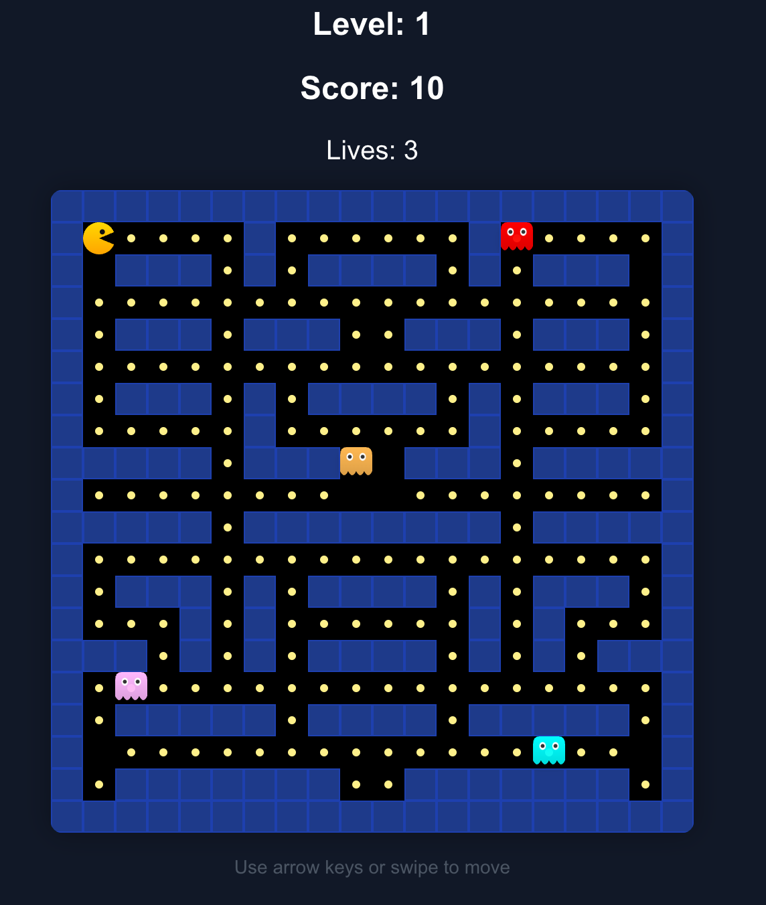

# OpenPacman 🎮

[](https://www.gnu.org/licenses/agpl-3.0.en.html)
[](https://nextjs.org/)
[](https://react.dev/)
[](https://www.typescriptlang.org/)
[](https://tailwindcss.com/)
[](https://zustand-demo.pmnd.rs/)

A modern, open-source implementation of the classic Pac-Man arcade game built with Next.js 16.1.1, React 19.2.3, TypeScript 5.9.3, and TailwindCSS 4.1.18. Features authentic ghost AI behaviors, power pellet mechanics, responsive touch controls, and retro arcade aesthetics.

**[🎮 Play Now](https://openpacman.vercel.app/)** | **[📖 Documentation](#-architecture)** | **[🤝 Contributing](#-contributing)**



---

## ✨ Features

### Gameplay

- 🕹️ **Classic Pac-Man mechanics** - Authentic dot-eating, ghost-chasing gameplay
- 👻 **Intelligent Ghost AI** - Four unique ghost personalities with distinct behaviors:
  - **Blinky (Red)** - Directly chases Pac-Man
  - **Pinky (Pink)** - Ambushes by targeting 4 tiles ahead
  - **Inky (Cyan)** - Uses Blinky's position for flanking maneuvers
  - **Clyde (Orange)** - Chases when far, retreats when close
- ⚡ **Power Pellets** - Turn the tables and eat frightened ghosts for bonus points
- 🔄 **Multiple Levels** - Progressive difficulty with increasing ghost speed
- 🏆 **High Score System** - Local persistence with top 5 scores

### Technical

- 🎵 **Web Audio API** - Synthesized retro sound effects (no audio files needed)
- 📱 **Responsive Design** - Full touch/swipe controls for mobile devices
- ⌨️ **Keyboard Support** - Arrow keys or WASD controls
- 🎨 **CRT Aesthetic** - Scanlines, glow effects, and arcade-style visuals
- ⚡ **60 FPS Gameplay** - Smooth animations with requestAnimationFrame
- 🧭 **A\* Pathfinding** - Intelligent ghost navigation

---

## 🚀 Quick Start

### Prerequisites

- **Node.js** 20.9.0 or later
- **npm** 9+ or **yarn** 1.22+ or **pnpm** 8+

### Installation

```bash
# Clone the repository
git clone https://github.com/brown2020/openpacman.git
cd openpacman

# Install dependencies
npm install

# Start development server
npm run dev
```

Open [http://localhost:3000](http://localhost:3000) to play!

### Available Scripts

| Command         | Description                              |
| --------------- | ---------------------------------------- |
| `npm run dev`   | Start development server with hot reload |
| `npm run build` | Create optimized production build        |
| `npm run start` | Start production server                  |
| `npm run lint`  | Run ESLint for code quality              |

---

## 🎮 How to Play

### Controls

| Platform    | Movement               | Pause            |
| ----------- | ---------------------- | ---------------- |
| **Desktop** | Arrow keys or WASD     | ESC or P         |
| **Mobile**  | Swipe in any direction | Tap Pause button |

### Objectives

1. **Eat all dots** to complete the level
2. **Avoid ghosts** - Contact means losing a life
3. **Collect power pellets** (large flashing dots) to turn ghosts blue
4. **Eat blue ghosts** for bonus points (200 → 400 → 800 → 1600)
5. **Complete all levels** to achieve victory!

### Scoring

| Item         | Points |
| ------------ | ------ |
| Dot          | 10     |
| Power Pellet | 50     |
| 1st Ghost    | 200    |
| 2nd Ghost    | 400    |
| 3rd Ghost    | 800    |
| 4th Ghost    | 1,600  |

---

## 🛠️ Tech Stack

### Core Dependencies

| Package                                  | Version | Purpose                         |
| ---------------------------------------- | ------- | ------------------------------- |
| [Next.js](https://nextjs.org/)           | 16.1.1  | React framework with App Router |
| [React](https://react.dev/)              | 19.2.3  | UI component library            |
| [Zustand](https://zustand-demo.pmnd.rs/) | 5.0.9   | Lightweight state management    |

### Styling & Build

| Package                                       | Version | Purpose                     |
| --------------------------------------------- | ------- | --------------------------- |
| [TailwindCSS](https://tailwindcss.com/)       | 4.1.18  | Utility-first CSS framework |
| [PostCSS](https://postcss.org/)               | 8.5.6   | CSS processing              |
| [TypeScript](https://www.typescriptlang.org/) | 5.9.3   | Static type checking        |

### Development

| Package                                                                       | Version | Purpose              |
| ----------------------------------------------------------------------------- | ------- | -------------------- |
| [ESLint](https://eslint.org/)                                                 | 9.39.2  | Code linting         |
| [eslint-config-next](https://nextjs.org/docs/app/api-reference/config/eslint) | 16.1.1  | Next.js ESLint rules |

---

## 🏗️ Architecture

### Project Structure

```
openpacman/
├── src/
│   ├── app/                    # Next.js App Router
│   │   ├── layout.tsx          # Root layout with metadata
│   │   ├── page.tsx            # Home page (game entry)
│   │   ├── globals.css         # Global styles & animations
│   │   └── fonts/              # Geist font files
│   │
│   ├── components/             # React components
│   │   ├── PacmanGame.tsx      # Main game container
│   │   ├── GameBoard.tsx       # Game board renderer
│   │   ├── StartScreen.tsx     # Title/menu screen
│   │   ├── Pacman.tsx          # Pacman entity (SVG)
│   │   ├── Ghost.tsx           # Ghost entity (SVG)
│   │   └── board/              # Board sub-components
│   │       ├── WallsLayer.tsx  # Maze walls
│   │       ├── DotsLayer.tsx   # Dots & power pellets
│   │       └── EntitiesLayer.tsx # Ghosts & Pacman
│   │
│   ├── stores/                 # Zustand state management
│   │   └── game-store.ts       # Central game state
│   │
│   ├── hooks/                  # Custom React hooks
│   │   ├── useGameLoop.ts      # Main game loop (60 FPS)
│   │   ├── useInput.ts         # Keyboard/touch input
│   │   └── useSound.ts         # Audio management
│   │
│   ├── utils/                  # Game logic utilities
│   │   ├── gameEngine.ts       # Ghost AI & collision
│   │   ├── gameUtils.ts        # Position & movement
│   │   ├── pathfinding.ts      # A* algorithm
│   │   ├── position.ts         # Position helpers
│   │   └── soundManager.ts     # Web Audio synthesis
│   │
│   ├── constants/              # Game configuration
│   │   └── gameConstants.ts    # Speeds, colors, timings
│   │
│   ├── levels/                 # Level definitions
│   │   └── gameLevels.ts       # Maze layouts
│   │
│   └── types/                  # TypeScript definitions
│       └── types.ts            # Interfaces & types
│
├── public/                     # Static assets
├── next.config.ts              # Next.js configuration
├── tailwind.config.ts          # Tailwind configuration
├── tsconfig.json               # TypeScript configuration
└── package.json                # Dependencies & scripts
```

### State Management

The game uses **Zustand** for state management with a single store:

```typescript
// Key state slices
interface GameStoreState {
  gameState: GameState; // Score, lives, level, flags
  pacmanPos: Position; // Pacman position
  ghosts: Ghost[]; // Ghost entities with AI state
  dots: Position[]; // Remaining dots
  powerPellets: Position[]; // Power pellet positions
  // ... actions
}
```

**Key selectors:**

- `selectCanPlay` - Check if game is in playable state
- `selectGameplay` - Game status flags
- `selectEntities` - All game entities
- `selectActions` - Store actions

### Game Loop Architecture

```
┌─────────────────────────────────────────────────────────┐
│                    useGameLoop (60 FPS)                 │
├─────────────────────────────────────────────────────────┤
│  ┌──────────┐  ┌──────────┐  ┌──────────┐  ┌─────────┐ │
│  │  Pacman  │  │  Ghost   │  │Collision │  │  Audio  │ │
│  │ Movement │  │    AI    │  │Detection │  │ Effects │ │
│  └────┬─────┘  └────┬─────┘  └────┬─────┘  └────┬────┘ │
│       │             │             │              │      │
│       └─────────────┴──────┬──────┴──────────────┘      │
│                            │                            │
│                    ┌───────▼───────┐                    │
│                    │  Zustand      │                    │
│                    │  Store Update │                    │
│                    └───────┬───────┘                    │
│                            │                            │
│                    ┌───────▼───────┐                    │
│                    │    React      │                    │
│                    │   Re-render   │                    │
│                    └───────────────┘                    │
└─────────────────────────────────────────────────────────┘
```

### Ghost AI Behavior

Each ghost has unique targeting logic:

| Ghost      | Chase Behavior                           | Scatter Corner |
| ---------- | ---------------------------------------- | -------------- |
| **Blinky** | Targets Pacman directly                  | Top-right      |
| **Pinky**  | Targets 4 tiles ahead of Pacman          | Top-left       |
| **Inky**   | Vector from Blinky through 2 tiles ahead | Bottom-right   |
| **Clyde**  | Chase if far, scatter if within 8 tiles  | Bottom-left    |

**Ghost Modes:**

- `CHASE` - Active pursuit using targeting logic
- `SCATTER` - Retreat to corner
- `FRIGHTENED` - Random movement, vulnerable
- `EATEN` - Return to ghost house
- `HOUSE` - Waiting to be released

---

## 🎨 Customization

### Adding New Levels

Edit `src/levels/gameLevels.ts`:

```typescript
const NEW_LEVEL: CellType[][] = [
  [1, 1, 1, 1, 1, ...],  // 1 = Wall
  [1, 0, 0, 0, 1, ...],  // 0 = Dot
  [1, 3, 1, 3, 1, ...],  // 3 = Power Pellet
  [1, 0, 4, 0, 1, ...],  // 4 = Ghost House
  [1, 2, 2, 2, 1, ...],  // 2 = Empty (no dot)
  ...
];

export const LEVELS: LevelConfig[] = [
  { layout: LEVEL_1, ghostSpeed: 1 },
  { layout: LEVEL_2, ghostSpeed: 1.2 },
  { layout: NEW_LEVEL, ghostSpeed: 1.4 },  // Add new level
];
```

### Adjusting Game Speed

Edit `src/constants/gameConstants.ts`:

```typescript
// Movement intervals (lower = faster)
export const PACMAN_MOVE_INTERVAL = 100; // ms
export const GHOST_MOVEMENT_INTERVAL = 300; // ms

// Ghost frightened duration
export const GHOST_FRIGHTENED_DURATION = 8000; // ms
```

### Modifying Ghost Behavior

Edit `GHOST_CONFIG` in `src/constants/gameConstants.ts`:

```typescript
export const GHOST_CONFIG = {
  BLINKY: {
    color: "#FF0000",
    speed: 1,
    releaseDelay: 0,
    scatterTarget: { x: 18, y: 0 },
  },
  // ... customize other ghosts
};
```

---

## 🔜 Roadmap

### Planned Features

- [ ] 🍒 Bonus fruit items
- [ ] 🌍 Global leaderboard (Firebase/Supabase)
- [ ] 🎨 Level editor
- [ ] 🎭 Custom themes/skins
- [ ] 📊 Statistics & achievements
- [ ] 🔊 Background music
- [ ] 👥 Multiplayer mode
- [ ] 📱 PWA support

### Completed Features

- [x] ⚡ Power pellet mechanics
- [x] 👻 Ghost vulnerability states
- [x] 🎵 Sound effects
- [x] 📱 Mobile touch controls
- [x] 🏆 Local high score system
- [x] 🔄 Multiple levels

---

## 🤝 Contributing

Contributions are welcome! Here's how to get started:

### Development Workflow

1. **Fork** the repository
2. **Clone** your fork:
   ```bash
   git clone https://github.com/YOUR_USERNAME/openpacman.git
   ```
3. **Create** a feature branch:
   ```bash
   git checkout -b feature/amazing-feature
   ```
4. **Make** your changes
5. **Test** locally:
   ```bash
   npm run build
   npm run lint
   ```
6. **Commit** with a descriptive message:
   ```bash
   git commit -m "feat: add amazing feature"
   ```
7. **Push** to your fork:
   ```bash
   git push origin feature/amazing-feature
   ```
8. **Open** a Pull Request

### Commit Convention

We follow [Conventional Commits](https://www.conventionalcommits.org/):

| Type       | Description                |
| ---------- | -------------------------- |
| `feat`     | New feature                |
| `fix`      | Bug fix                    |
| `docs`     | Documentation only         |
| `style`    | Formatting, no code change |
| `refactor` | Code restructuring         |
| `perf`     | Performance improvement    |
| `test`     | Adding tests               |
| `chore`    | Maintenance tasks          |

### Code Style

- **TypeScript** - Strict mode enabled
- **ESLint** - Next.js recommended rules
- **Functional components** - No class components
- **Zustand** - For all global state
- **TailwindCSS** - For all styling

---

## 📝 License

This project is licensed under the **GNU Affero General Public License v3.0 (AGPL-3.0)** - see [`LICENSE.md`](LICENSE.md) for details.

---

## 📬 Contact

**Stephen Brown**

- 📧 Email: [info@ignitechannel.com](mailto:info@ignitechannel.com)
- 🌐 Website: [https://ignite.me](https://ignite.me)
- 🐙 GitHub: [@brown2020](https://github.com/brown2020)

**Project Links:**

- 🎮 Live Demo: [https://openpacman.vercel.app](https://openpacman.vercel.app)
- 📦 Repository: [https://github.com/brown2020/openpacman](https://github.com/brown2020/openpacman)
- 🐛 Issues: [https://github.com/brown2020/openpacman/issues](https://github.com/brown2020/openpacman/issues)

---

## 🙏 Acknowledgments

- **Namco** - Original Pac-Man game (1980)
- **Toru Iwatani** - Pac-Man creator
- [The Pac-Man Dossier](https://www.gamedeveloper.com/design/the-pac-man-dossier) - Ghost AI reference
- [Next.js](https://nextjs.org/) - React framework
- [Zustand](https://github.com/pmndrs/zustand) - State management
- [TailwindCSS](https://tailwindcss.com/) - CSS framework
- [Vercel](https://vercel.com/) - Hosting platform

---

<div align="center">

**Made with ❤️ and 👾**

⭐ Star this repo if you enjoyed the game!

</div>
